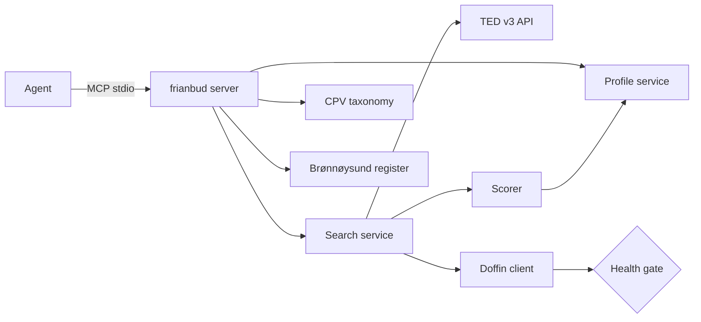

# frianbud

[](https://www.npmjs.com/package/frianbud)
[](https://github.com/Heku-I/frianbud/actions/workflows/ci.yml)
[](LICENSE)
[](https://modelcontextprotocol.io)

AI agents, with direct access to Norwegian public tenders.

Norway publishes about 742 billion NOK of public procurement every year. By law, every contract is open. But there is no agent-friendly way to read it. `frianbud` is the open MCP server that fixes that — your agent can search, filter, score, and explain Norwegian tenders, personalized to your company, with real winner data and incumbent intelligence baked in.

## What you can ask your agent

> "Find me cleaning contracts in Oslo closing in the next two weeks."

> "Who won the last 10 IT consulting contracts from Oslo Kommune? Group winners by org number and rank by total contract value."

> "What tenders match my company profile right now? Show the score breakdown."

> "Look up Brønnøysund record for org 914791723 — how many employees, are they bankrupt?"

> "Find recent renhold rammeavtaler awarded in Oslo. Filter to contracts where cleaning is the primary CPV — skip the construction tenders that mention cleaning as a side category."

> "Set up my company profile — we're a cleaning company in Oslo, contracts between 100k and 5M NOK."

## Install

Add `frianbud` to your MCP client. The minimum config:

```json
{
  "mcpServers": {
    "frianbud": {
      "command": "npx",
      "args": ["-y", "frianbud"]
    }
  }
}
```

For Claude Desktop, paste this into `claude_desktop_config.json`. For VS Code and Cursor, paste it into your client's MCP settings. Restart your client and the eight `frianbud` tools become available to the agent.

### Recommended: enable Doffin's official Public API

frianbud ships with two Doffin integration paths. By default, the server uses an unofficial SPA backend (no auth required, but no server-side filters and 1000-hit cap). For production-quality Doffin coverage — server-side filtering by CPV/region/status/date plus structured lot-level winner data — register a free subscription key at [developer.doffin.no](https://developer.doffin.no) and pass it via env:

```json
{
  "mcpServers": {
    "frianbud": {
      "command": "npx",
      "args": ["-y", "frianbud"],
      "env": {
        "FRIANBUD_DOFFIN_API_KEY": "your-subscription-key-here"
      }
    }
  }
}
```

Signup takes about two minutes via EU Login / ID-porten. Subscribe to the **Public API** product and copy your primary subscription key. The key is sent as `Ocp-Apim-Subscription-Key` on every Doffin request.

## First-time setup

Before searching, set up your company profile in a natural conversation:

```
You: I want to set up my profile. We're a cleaning company in Oslo.

Agent: [calls setup_profile] What is your company name, and what contract value range do you typically pursue?

You: Acme Cleaning AS. Contracts between 100k and 5M NOK.

Agent: [calls setup_profile again with growing draft] I have found two CPV codes that match: 90910000-9 (Cleaning services / Rengjøring) and 90919000-2 (Office cleaning / Kontorrengjøring). Confirm both?

You: Yes both.

Agent: [calls setup_profile with complete draft] Profile saved. You can ask me to find tenders any time.
```

The profile is stored at the OS-standard config location (`~/.config/frianbud/profile.json` on macOS and Linux, `%APPDATA%\frianbud\profile.json` on Windows). Override with the `FRIANBUD_PROFILE_PATH` environment variable for multi-profile setups.

## Tools

| Tool | What it does |
|---|---|
| `setup_profile` | Idempotent profile builder. Returns missing fields and auto-suggests CPV codes from the company description. |
| `get_profile` | Return the saved profile. |
| `search_tenders` | Search across TED and Doffin, scored against the profile. Each result includes a 0-100 match score with per-signal reasons (CPV overlap, region match, value-in-range, language, deadline feasibility, buyer familiarity). |
| `get_tender` | Full detail for one tender by ID, including the source's raw eForms payload. |
| `list_upcoming_deadlines` | Profile-matched tenders closing soon. |
| `list_recent_awards` | Recently-awarded contracts with full winner data — name, org number, per-winner contract value, total value. Filters out mixed-scope false positives via primary-CPV check. Auto-derives Norwegian keywords from CPV labels for Doffin coverage. |
| `lookup_cpv` | Bidirectional CPV lookup: text to suggested codes, or code to Norwegian/English label and ancestors/descendants. |
| `lookup_organization` | Brønnøysund register lookup by org number. Canonical name, registered address, industry code, employee count, bankruptcy / winding-down flags. Use this to validate winner identities, size up competitors, or detect typo variants of the same legal entity. |

## What makes scoring useful

Every search result comes with a structured score breakdown an agent can explain. For a profile-tuned query, you get something like:

```
ted:348862-2025  Cleaning services framework agreement  score=88
  cpv_overlap        +35  100% CPV match (90910000-9 primary)
  region_match       +20  region NO081 in profile
  value_in_range     +15  value within band (35M NOK)
  language_match     +10  language deliverable
  deadline_feasibility +10 28 days lead time
  buyer_familiarity  +0   buyer not in preferred list
```

No black-box ML. No hidden weights. Every signal is a pure function in `src/domain/scorer-signals.ts` and adding a new one is a small, bounded contribution.

## Architecture



- **TED** is the EU's Tenders Electronic Daily — the official, stable open API. Every Norwegian above-threshold tender (~1.4M NOK and up) is published there. We extract winners, contract values, and the full eForms structure.
- **Doffin** is Norway's national procurement database, covering below-threshold tenders. With `FRIANBUD_DOFFIN_API_KEY` set, the server uses Doffin's official Public API (`api.doffin.no/public/v2/search`) with full server-side filtering and lot-level structured winner data. Without a key, the server falls back to the unofficial SPA backend (works, but with the limitations noted below).
- **Brønnøysund Register Centre** (`data.brreg.no`) provides canonical company data — registered names, addresses, industry codes, employee counts, parent organizations, and dissolution dates. Used to validate winner identities, characterize competition, and detect inactive firms.
- **The scorer** is rule-based and deterministic.
- **CPV codes** ship bundled (~9,500 entries) with both English and Norwegian labels. Norwegian translations are sourced from Doffin's public CPV picker.

## Known limitations

Honest list of what v1 does *not* do, with workarounds where they exist.

- **Doffin without an API key uses the unofficial SPA backend** — no server-side CPV/status/location filters, 1,000-hit accessibility cap, contract isn't versioned. Set `FRIANBUD_DOFFIN_API_KEY` to switch to Doffin's official Public API and get all those filters server-side plus structured lot-level winner data. Disable Doffin entirely with `FRIANBUD_DOFFIN=off`.
- **TED only covers above-threshold tenders** (~1.4M NOK and up). For Norwegian SMEs competing for smaller contracts, Doffin is what matters.
- **TED's place-of-performance reflects buyer registration, not actual operating region.** "Akershus kollektivterminaler" gets tagged NO081/Oslo because their HQ is in Oslo, even though they operate Akershus terminals. Workaround: call `lookup_organization` on the buyer's org number to get the registered municipality and reason about it directly.
- **TED's flat search response collapses winner-name per language but keeps every related party in winner-identifier.** When the arrays don't align (1 name + 5 ids), we deliberately drop org numbers rather than mis-attribute them. For length-1 cases the alignment is correct ~85% of the time and incorrect ~15% (TED's flat output sometimes returns a related party as the lone identifier). Agents needing strong accuracy should verify each TED-side org number via `lookup_organization` and drop mismatches by canonical-name comparison. Doffin via the official Public API has lot-by-lot structured winners and doesn't have this problem.
- **Scoring is deliberately simple in v1.** Pure rule-based, deterministic, transparent. Smarter scoring (text similarity, embeddings) is on the v0.2 roadmap but won't replace the rule-based path.
- **No write actions.** This server is read-only. It does not submit bids or modify any external state.
- **Norwegian CPV labels: 99.5% coverage.** A handful of obscure stationary categories don't have Doffin translations yet. PRs welcome.

## Recipes

A few prompts that get the most out of the tool stack:

**Weekly tender brief** (schedule as a recurring task):

```
Run my weekly Norwegian tender brief.
1. search_tenders against my profile (no extra filters).
2. list_upcoming_deadlines withinDays: 14.
3. list_recent_awards sinceDays: 7, cpvCodes from my profile.
4. search_tenders with query: "renhold OR rengjøring tildelt" to catch
   sub-threshold awards Doffin holds exclusively.
Then write three sections: direct fits to bid on, post-award subcontracting
leads, competitive intel about who's winning the rammeavtaler I'd want.
```

**Incumbent ranking** (annual, pre-renewal-cycle):

```
Use list_recent_awards with cpvCodes ["90910000-9"] and sinceDays 365.
For each winner, call lookup_organization on the org number to get the
canonical name, employee count, and registered region. Group by org number
to dedupe typo variants. Rank top 10 by frequency and total contract value.
Flag any with bankrupt or underWinding set.
```

**Post-award follow-up** (track construction projects for cleaning subcontracting):

```
Every two weeks, call get_tender on doffin:2026-107918 (Bryn skole) and
doffin:2026-107876 (Breigata 9). When the contract is awarded — status
becomes "awarded" with an award.winners block — tell me who won, give me
their org number, look them up in Brønnøysund, and draft a Norwegian
outreach email pitching nybyggvask / sluttrengjøring services for handover.
```

## Contributing

Areas where community eyes are most useful:

1. **Doffin client robustness.** Doffin can change its endpoints anytime. If `npm run test:doffin` fails on your machine, that's a signal — open an issue or a PR with the new contract documented.
2. **CPV label coverage.** PRs to fill in the missing 0.5% Norwegian labels (or improve existing translations) are welcome.
3. **Scorer signals.** Adding a new ranking signal is a small, well-bounded contribution — see `src/domain/scorer-signals.ts` for the existing pattern.
4. **TED winner extraction beyond the flat search response.** When TED's flat winner-name + winner-identifier arrays misalign, we drop org numbers to avoid mis-attribution. Fetching the full eForms XML and parsing lot-by-lot tender results would close that gap.
5. **NUTS region enrichment.** Cross-referencing the buyer's org number against Brønnøysund subsidiaries (`underenheter`) would let us surface actual operating regions rather than just registered office. Hooks for this are already in place via the `lookup_organization` tool.

See `CONTRIBUTING.md` for the full guide.

## License

MIT. Norwegian public procurement data is open by law; this server is open by choice.

---

## Norsk

**frianbud** gir AI-agenter direkte tilgang til norske offentlige anbud fra TED og Doffin — gratis, åpen kildekode, og bygget for agentenes tidsalder. Med Brønnøysund-oppslag innebygd kan agentene også verifisere vinnere, sjekke selskapsstørrelse, og bygge ekte konkurrentanalyser. Offentlige data skal være tilgjengelig for alle, ikke låst bak en betalingsmur. Prosjektet er åpent for bidrag, særlig på Doffin-laget der vi trenger blikk fra det norske utviklermiljøet.
