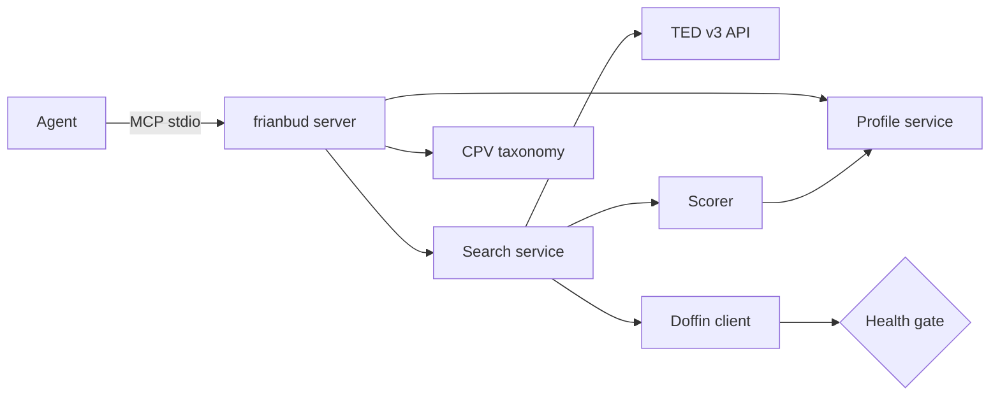

# frianbud

[](https://www.npmjs.com/package/frianbud)
[](https://github.com/Heku-I/frianbud/actions/workflows/ci.yml)
[](LICENSE)
[](https://modelcontextprotocol.io)

AI agents, with direct access to Norwegian public tenders.

Norway publishes about 742 billion NOK of public procurement every year. By law, every contract is open. But there is no agent-friendly way to read it. `frianbud` is the open MCP server that fixes that — your agent can search, filter, and explain Norwegian tenders, personalized to your company.

## What you can ask your agent

> "Find me cleaning contracts in Oslo closing in the next two weeks."

> "Who won the last five IT contracts from Oslo Kommune?"

> "What tenders match my company profile right now?"

> "Show me upcoming construction tenders under 5 million NOK."

> "Look up the CPV code for office supply procurement."

> "Set up my company profile — we're a cleaning company in Oslo."

## Install

Add `frianbud` to your MCP client. The same JSON snippet works for Claude Desktop, VS Code, and Cursor:

```json
{
  "mcpServers": {
    "frianbud": {
      "command": "npx",
      "args": ["-y", "frianbud"]
    }
  }
}
```

For Claude Desktop, paste this into `claude_desktop_config.json`. For VS Code and Cursor, paste it into your client's MCP settings. Restart your client and the seven `frianbud` tools become available to the agent.

## First-time setup

Before searching, set up your company profile in a natural conversation:

```
You: I want to set up my profile. We're a cleaning company in Oslo.

Agent: [calls setup_profile] What is your company name, and what contract value range do you typically pursue?

You: Acme Cleaning AS. Contracts between 100k and 5M NOK.

Agent: [calls setup_profile again with growing draft] I have found two CPV codes that match: 90910000-9 (Cleaning services / Rengjøring) and 90919000-2 (Office cleaning / Kontorrengjoring). Confirm both?

You: Yes both.

Agent: [calls setup_profile with complete draft] Profile saved. You can ask me to find tenders any time.
```

The profile is stored at the OS-standard config location (`~/.config/frianbud/profile.json` on macOS and Linux, `%APPDATA%\frianbud\profile.json` on Windows). Override with the `FRIANBUD_PROFILE_PATH` environment variable for multi-profile setups.

## Tools

| Tool | What it does |
|---|---|
| `setup_profile` | Idempotent profile builder. Returns missing fields and suggests CPV codes from the company description. |
| `get_profile` | Return the saved profile. |
| `search_tenders` | Search across TED and Doffin, scored against the profile. |
| `get_tender` | Full detail for one tender by ID, including the source's raw payload. |
| `list_upcoming_deadlines` | Profile-matched tenders closing soon. |
| `list_recent_awards` | Recently-awarded contracts, optionally filtered by buyer or CPV. |
| `lookup_cpv` | Bidirectional CPV lookup: text to suggested codes, or code to label and ancestors/descendants. |

## Architecture



- **TED** is the EU's Tenders Electronic Daily — the official, stable open API. Every Norwegian above-threshold tender (~1.4M NOK and up) is published there.
- **Doffin** is Norway's national procurement database, covering below-threshold tenders. The integration uses Doffin's public webclient API (the same endpoints doffin.no's UI talks to). It's not officially documented as a public API, so we treat it as best-effort and gate it behind a health check.
- **The scorer** is rule-based and deterministic. Every result includes a 0-100 score and the reasons it was given. No black-box ML, no hidden weights — every signal is auditable.
- **CPV codes** ship bundled (~9,500 entries) with both English and Norwegian labels. Norwegian translations are sourced from Doffin's CPV picker.

## Known limitations

- **Doffin is unofficial.** If Doffin changes its internal endpoints, the client may temporarily return zero results. The server detects this via a health check and falls back to TED-only with a clear warning. Disable Doffin entirely with `FRIANBUD_DOFFIN=off`.
- **Doffin's API has no server-side filters beyond free-text search.** CPV codes, status, and date filters in the request body are silently ignored — Doffin's frontend filters in the browser after the call. We work around this by auto-deriving Norwegian keywords from CPV labels (e.g., "cleaning" CPVs become a "Rengjøring tildelt" search), and post-filtering after detail enrichment. Coverage on narrow CPV queries is therefore weaker than TED's; for sub-threshold contracts that exist only on Doffin, the agent may miss some.
- **Doffin caps results at 1,000 per query.** Even with optimal filters, you can't page past the first 1k matching hits.
- **TED only covers above-threshold tenders** (~1.4M NOK and up). For Norwegian SMEs competing for smaller contracts, Doffin coverage is what matters. Help us keep it healthy (see Contributing).
- **NUTS-3 region tagging on TED can be misleading.** TED records `place-of-performance` based on what the buyer publishes, which is often the buyer's registered office rather than the actual operating region (e.g., "Akershus kollektivterminaler" gets tagged NO081/Oslo because their HQ is in Oslo). Fixing this requires cross-referencing buyer org numbers against Brønnøysund — on the v0.2 roadmap.
- **Scoring is deliberately simple in v1.** Pure rule-based, deterministic, transparent. Smarter scoring (text similarity, embeddings) is on the roadmap but won't replace the rule-based path.
- **No write actions.** This server is read-only. It does not submit bids or modify any external state.
- **Norwegian CPV labels: 99.5% coverage.** A handful of obscure stationary categories don't have Doffin translations yet. PRs welcome.
- **`get_tender` returns the unified `Tender` plus the source's raw payload, but the agent should expect some fields to be sparse.** TED leaves `winner-name` empty on some CAN notices (no winner declared) and the `description` field falls back to title when none of the eForms description-* variants are populated. The `raw` field is always there for agents that need the full eForms structure.

## Contributing

Three areas need community eyes:

1. **Doffin client robustness.** Doffin can change its endpoints anytime. If `npm run test:doffin` fails on your machine, that's a signal — open an issue or a PR with the new contract documented.
2. **CPV label coverage.** PRs to fill in the missing 0.5% Norwegian labels (or improve existing translations) are welcome.
3. **Scorer signals.** Adding a new ranking signal is a small, well-bounded contribution — see `src/domain/scorer-signals.ts` for the existing pattern.

See `CONTRIBUTING.md` for the full guide.

## License

MIT. Norwegian public procurement data is open by law; this server is open by choice.

---

## Norsk

**frianbud** gir AI-agenter direkte tilgang til norske offentlige anbud fra TED og Doffin — gratis, åpen kildekode, og bygget for agentenes tidsalder. Offentlige data skal være tilgjengelig for alle, ikke låst bak en betalingsmur. Prosjektet er åpent for bidrag, særlig på Doffin-laget der vi trenger blikk fra det norske utviklermiljøet.
